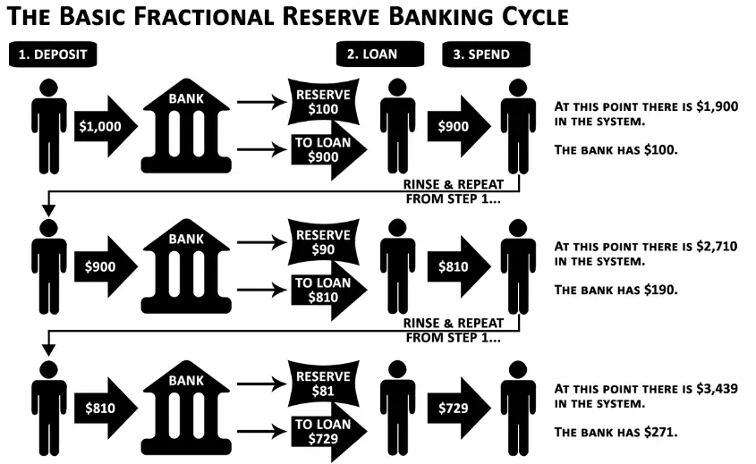
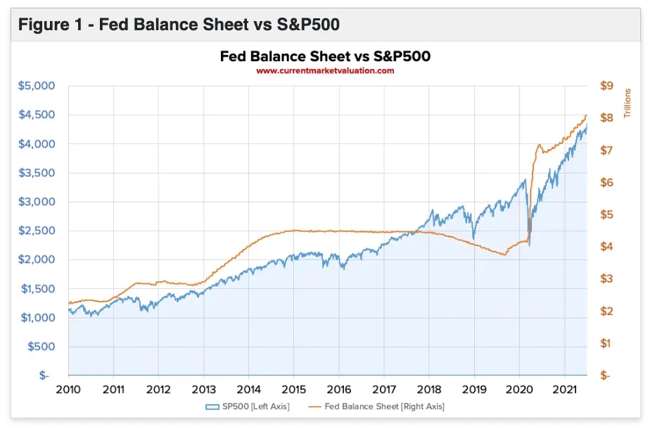
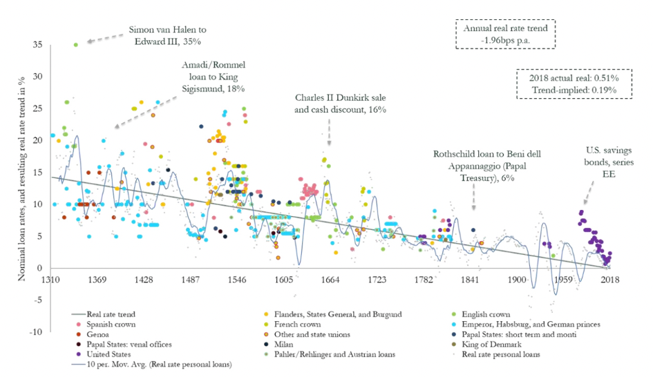
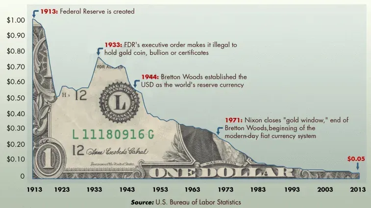
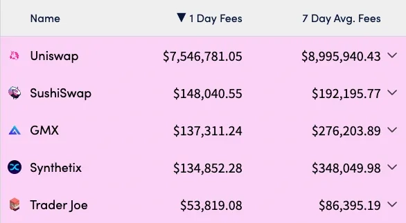

Blockchains, at their essence, are remarkably straightforward. They function as distributed ledgers, meaning no single entity controls them. Ledgers are merely lists of transactions, but what these lists can do is only beginning to be understood.

## Financial Intermediaries

While home to many reputable institutions and ethical professionals, the banking industry has a darker side that often operates behind closed doors. Major global banks have been implicated in numerous instances of rule-bending and outright violations, frequently escaping significant consequences due to the convoluted structure of the financial system.

The revolving door between Wall Street and regulatory agencies further reinforces this apparent impunity. "Goldman" Gary Gensler, head of the SEC, accumulated an eye-popping nine-figure net worth before taking public office thanks to his multi-decade, loyal stint at Goldman Sachs. Jerome Powell, the head chairman of the US Federal Reserve, has a net worth estimated to be north of $50 million after he spent years working for various investment banks in New York City before moving on to the US Department of the Treasury in 1990.

There are apparent conflicts of interest. Even if those in charge of the rules are perfectly ethical, there is still ample room for unethical behavior by middlemen—banks, brokers, asset management firms, and any other business that requires customer deposits.

## An Alternative

Blockchains offer an alternative framework in that all transaction details can be made public, and all protocols are open source. Previous types of intermediaries have become obsolete. In contrast, new types of financial intermediaries must adhere to the overarching algocratic nature of decentralized systems and their underlying risks.

Its important to remember what we have to work with.

<table>
  <thead>
    <tr>
      <th>Bank</th>
      <th>Total Fines ($)</th>
      <th>Number of Fines</th>
    </tr>
  </thead>
  <tbody>
    <tr><td>Bank of America (US)</td><td>$82,737,699,939</td><td>214</td></tr>
    <tr><td>JPMorgan Chase (US)</td><td>$35,744,240,670</td><td>158</td></tr>
    <tr><td>Citigroup (US)</td><td>$25,450,155,764</td><td>122</td></tr>
    <tr><td>Wells Fargo (US)</td><td>$21,340,036,745</td><td>181</td></tr>
    <tr><td>Deutsche Bank (Germany)</td><td>$18,156,533,878</td><td>59</td></tr>
    <tr><td>UBS (Switzerland)</td><td>$16,792,800,910</td><td>83</td></tr>
    <tr><td>Goldman Sachs (US)</td><td>$16,365,468,987</td><td>44</td></tr>
  </tbody>
</table>

Not all banks are bad, just as not all DeFi protocols are good. The above numbers emphasize that even the biggest and most regulated banks misbehave. They have unwieldy powers that influence every level of the economy, but of course, they are still subject to the puppet mastery of global central banks—in particular, the US Federal Reserve.

## The FED

The Federal Reserve (FED) was established in 1913 as the third central banking system in the United States. From 1907 to 1910, severe public panic led to bank runs. Bank runs occur when more people want to withdraw from a bank than a bank can handle. These events are possible because of fractional reserve lending, which gives banks leverage and enables them to hold only a portion of your deposit on hand - aka collateral - while they lend the rest to other customers.

In 1910, after helping bail out a particularly bad bank run, Chase Bank's founder, J.P. Morgan, and other high-ranking bankers secretly secluded themselves for 10 days to figure out how they could enhance the American banking system. This plan came to fruition three years later in the form of the Federal Reserve, a singular central bank for the USA. The FED can be considered a hybrid or different faction within the US government.

It's part of the US governmental purview, but Congress doesn't necessarily have to listen. Congress enacts fiscal policy, such as raising and lowering tax rates, while central banks, like the FED, enact monetary policy, such as raising and lowering interest rates. The two are often in cahoots.

As the US gained a larger share of global dominance after the two World Wars, the FED's macroeconomic role only gained more prominence. Since the chart-breaking inflation metrics of the 1970s, the FED has generally enacted an expansionary monetary policy by lowering interest rates.

## Fed Balance Sheet vs. S&P 500

Many compare inflated asset prices worldwide to the FED's balance sheet. Let's look at the difference between dollars the FED and the S&P 500 put into circulation, a well-rounded index of some of America's largest public companies.

To add to the above comparison, the correlation between dollars put into circulation by the FED and the S&P 500's price was 0.92 between April 2020's crash and 2021's all-time high.

## Defi Doubters

"The test of a first-rate intelligence is the ability to simultaneously hold two opposed ideas in mind and still retain the ability to function."
F. Scott Fitzgerald

There are generally two types of DeFi doubters:
Those needing help understanding the tech and discount it with a misled opinion.
Those who understand the tech but don't appreciate the societal and economic impacts that decentralization has to offer.

A more thoughtful approach to crypto and DeFi is to be skeptically optimistic. With any new technology, there will be disruption, and not all of it will be good. The primary problem in blockchain-related technology is that most people need help understanding it. It's easy to get scammed when you don't know what you're doing, and it's easy to trust a snake oil salesperson if you think they know what they're talking about. As is the case with the medical and scientific fields, it doesn't take a lot of knowledge in crypto to sound like you know what you're talking about. Until the average user learns what they need to know or until crypto applications' UI/UX flows reinforce all they need to know in their users' mindsets, crypto will remain a wild west to the uninformed.

While it's better to be an optimistic skeptic, it's ok to be a DeFi Doubter, but what's the alternative? A continuation of opaque market procedures, unsustainable monetary policy, and hyper-inflationary events of debased fiat currencies becoming the norm?

The world is trending in a populist, deglobalizing direction, likely bringing about continued fiscal and monetary looseness. The plan is to tame inflation (9.1% in the US as of June 2022) by increasing interest rates over the next few years. As an asset class, crypto has never experienced a prolonged environment of rising interest rates, so it will be interesting to see how prices react. However, a solid case is to be made that interest rates will stay elevated for a while.

Below is a chart of the last 700 years of interest rates across the globe.

As the US proceeds to decouple itself from its previous role of international protector and, in some cases – aggressor in exchange for a more isolationist position, free global trade will struggle to sustain the exponential growth it's experienced over the past 50-70 years. Alongside broken supply chains, uprising political conflicts, and currency debasements, politicians and central bankers will have no choice but to enact a populist fiscal policy (low taxes & high spending) and a liberal monetary policy (low interest rates & potentially quantitative easing & yield curve control).

This means that fiat money will continue to devalue over time. For now, USD is accruing more value as the world outside of the US struggles to find or create worthy alternatives, but is that sustainable?

The chart below shows how much the value of $1 has declined from 1913 to 2013.

TL;DR In today's terms, $1 in 1900 was equivalent to $26.14 in 2020, implying a 96.2% decrease in purchasing power.

So, where does DeFi come in? It varies. If you're in one of the wealthier countries in the world, you may utilize DeFi as an alternative investment class. For those in less financially secure countries, you may be using DeFi because you don't have any other option.

## DeFi's Use Cases Today

### Stable Coins

Let's say you live in Turkey. The Turkish Lira experienced a reported 78% inflation from 2021-2022. So, if the bank gives you back your deposit, your $100 worth of TRL will be roughly $22. This type of heartache used to be unavoidable for the global middle and lower classes, but now there's an alternative.

Instead of using a soon-to-be-defunct domestic bank in a country with a falling currency, you can open a non-custodial wallet like Solflare and securely store infinite digital assets. This wallet isn't physical. You can bring it across borders by remembering your recovery phrase or keeping a copy of your private key.

Operational security risks and other nuances need to be considered, but this example gives you an idea of what's possible. How easy is it to withdraw $25,000 from your bank? How easy is it to travel across violent borders with that $25,000—especially if that $25,000 worth of value is in a currency other than the USD? The answers are all that it is exceedingly difficult to do so without DeFi.

### Censorship Resistance

Real estate debt levels and nationalized industry have taken a toll on the Chinese banking system, and some banks have already censored withdrawals. Chinese authorities recently switched some citizen health codes from Covid negative to positive (which effectively banned them from all public venues and transport systems) to prevent them from withdrawing from their bank. In May of 2022, it was reported that nearly 1 million Chinese customers were unable to withdraw money from bank accounts.

Then tanks were deployed on the protesters who had their funds frozen.

Regarding centralization and censorship, China is extreme, but the world operates on a spectrum. The need for DeFi also operates on that spectrum.

### Yield Generation

Crypto has been iterating on its forms of yield generation for some time. Some of it is a positive byproduct of the tools used within DeFi, and some of the more centralized versions of it, like Celsius, are nothing but loosely regulated, falsely marketed, over-leveraged degeneracy. Using liquidity pools is one example of genuine yield generation that cuts out the middleman and allows regular people to profit from their digital assets.

AMMs are algorithms programmed atop a blockchain that lets you trade one digital asset for another using a pool of funds and a pricing mechanism. Liquidity providers are usually paid in one of two ways with a share of the trading fees or an incentivized liquidity allocation. Incentivized liquidity allocations (liquidity mining campaigns) are unsustainable, but extending a percentage of trading fees to liquidity providers is not.

Below is a list of the top 5 7-Day Average Fees metrics DEXes across various blockchains.

The fee model for nearly all these DEXes is that traders pay a variation of "Trading fees to liquidity providers." This is a prime example of democratized access to a yield that was gaited and exclusively available to market makers in a TradFi framework. Utilizing AMMs also makes financial services more transparent, as the entire convoluted trade life cycle is simplified and settled on a public blockchain.

Ryan Selkis, the CEO of Messari, recently published a [thread](https://twitter.com/twobitidiot/status/1551874256761659393?s=20&t=cDNrQAr0FsQJXotpRolEAA) of 35 use cases for which you can use DeFi. It's worth a scroll.

## Moving On

There is much more to discuss concerning all the moving parts and issues involved with DeFi, but this course is just a 101. Having gotten this far in the system, you'll now understand enough to venture into the real world. The next chapter will give you all the necessary resources to onboard to DeFi and start self-custodying your assets.
